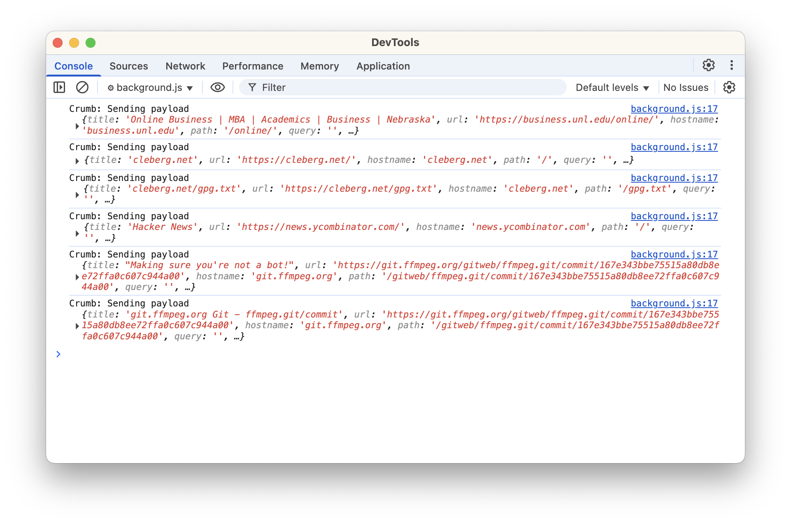
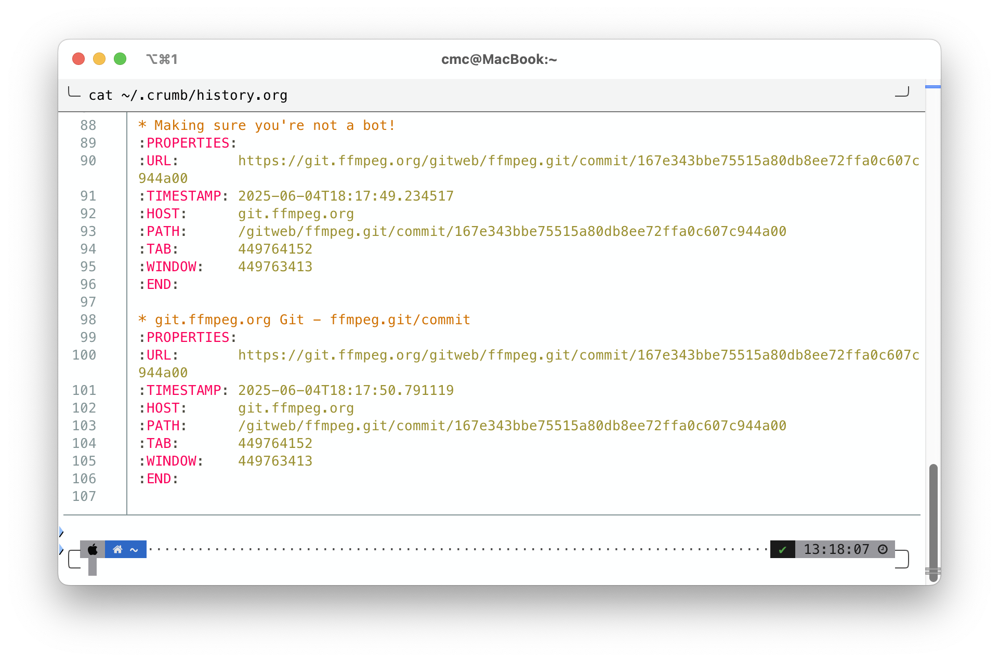
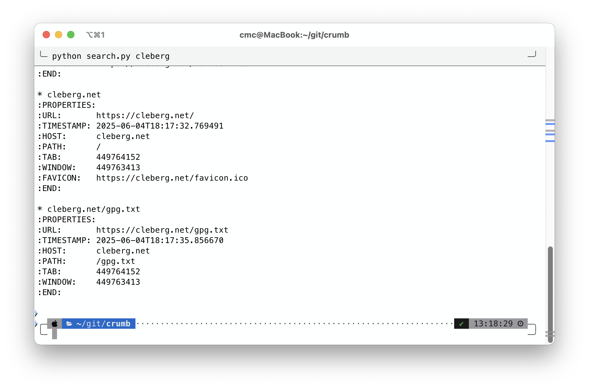

[](https://deepwiki.com/ccleberg/crumb)

Crumb is a local-only browser history tracker. It consists of two parts:
a WebExtension-based browser plugin and a local HTTP server. Crumb logs
each visited web page to a plaintext file in Org-mode format.

# Components

- Browser extension (WebExtension API, JavaScript)
- Local HTTP listener (Python + Flask)
- Plaintext log file (~/.crumb/history.log)

# Functionality

Each time a page is loaded in the browser, the extension sends the page
metadata to the local server. The server appends this data to a
structured log file.

Data captured per page:

- Page title
- URL
- Timestamp (UTC)
- Hostname
- Path
- Optional: query string, tab ID, window ID, favicon URL

The log is formatted as an Org-mode file, with one top-level heading per
visit and standard `:PROPERTIES:` metadata.

# Requirements

- Python 3.x
- Flask
- A Chromium-based or Firefox browser with extension developer mode
  enabled

# Usage

1.  Start the local listener:

    ``` shell
    python3 -m venv venv
    source ./venv/bin/activate
    pip install -r requirements.txt
    python server.py
    ```

2.  Load the extension into your browser:

    - Enable Developer Mode
    - Load the `crumb_extension/` directory

3.  Browse the web. Entries will appear in `~/.crumb/history.org`

4.  Search the log using:

    ``` shell
    python search.py <term>
    ```

# Example Log Entry

``` org
* Example Domain
:PROPERTIES:
:URL:       http://example.com
:TIMESTAMP: 2025-06-04T20:31:01.123456
:HOST:      example.com
:PATH:      /
:TAB:       143
:WINDOW:    1
:FAVICON:   https://example.com/favicon.ico
:END:
```

# Preview Images

Screenshots of Crumb in use.

<figure>

<figcaption>Developer Console Output</figcaption>
</figure>

<figure>

<figcaption>Org-Mode History Log</figcaption>
</figure>

<figure>

<figcaption>Search Utility in Terminal</figcaption>
</figure>

# Limitations

- Browser extensions cannot write files directly; communication requires
  the local server.
- History is stored in plaintext and is not encrypted. You can bolt-on a
  third-party encryption tool, if required.
- Data is stored locally and is never transmitted externally.

# License

GPL 3.0 License. See LICENSE file.
